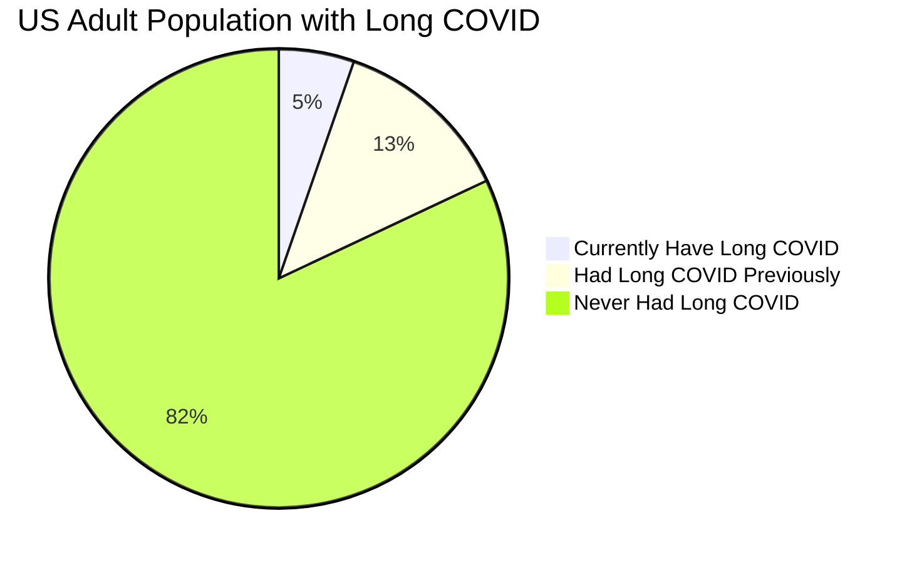
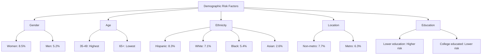
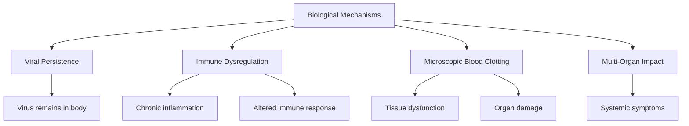
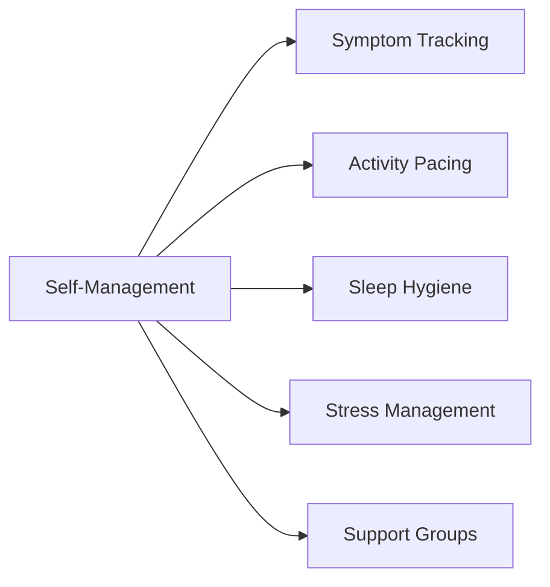
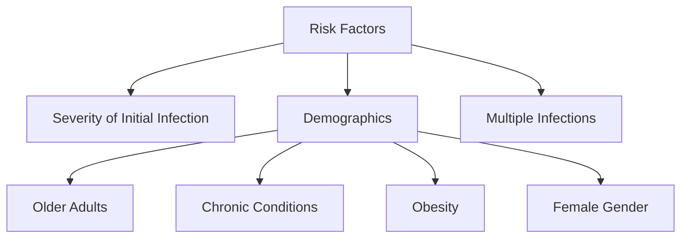

# Long COVID Research Report

## Overview
Long COVID, also known as Post-COVID Conditions (PCC) or post-COVID-19 syndrome, is a complex condition that occurs when symptoms persist or develop beyond the initial COVID-19 infection period. This report summarizes current research findings on Long COVID, its symptoms, prevalence, and diagnostic criteria.

## Current Statistics and Economic Impact

### Prevalence Statistics (2024)

### Economic Impact
- **Healthcare System Burden**
  - Requires multidisciplinary approach
  - Resource-intensive care
  - Complex diagnosis procedures
  - Strain on healthcare providers

- **Workforce Impact**
  - 79% report activity limitations
  - 25% report severe activity limitations
  - 40% experience food insecurity
  - 20% have difficulty with housing payments
  - 10% forced to stop working temporarily

## Definition and Symptoms

### Definition
Long COVID is characterized by symptoms that continue or develop beyond 12 weeks to 3 months after the initial SARS-CoV-2 infection. It can affect any system of the body and is not limited to those who had severe initial symptoms - even people with mild or asymptomatic COVID-19 can develop long COVID.

### Physical Symptoms
| System | Symptoms |
|--------|-----------|
| General | • Fatigue and extreme tiredness • Shortness of breath • Joint pain and muscle aches |
| Cardiovascular | • Chest pain or tightness • Palpitations • Irregular heartbeats |
| Respiratory | • Breathlessness • Persistent cough |
| Neurological | • Brain fog • Headaches • Sleep disturbances • Pins and needles • Dizziness |
| ENT | • Tinnitus and earaches • Sore throat • Loss of taste or smell • Nasal congestion |
| Gastrointestinal | • Abdominal pain • Diarrhea • Nausea and vomiting • Reduced appetite |

### Psychological Symptoms
- Depression
- Anxiety
- Changes in mental health and wellbeing
- Memory and concentration problems

## Demographic Impact

### Risk by Demographics

### Special Population Groups
- Transgender individuals: 11% prevalence
- People with disabilities: 12% prevalence
- Lower income individuals: Higher risk
- Essential workers: Increased exposure risk

## Biological Mechanisms

## Treatment Options

### Current Medical Treatments
1. **Investigational Drugs**
   - Antivirals (nirmatrelvir/ritonavir)
   - Antihistamines (loratadine, fexofenadine)
   - Anticoagulants (apixaban)
   - Low-dose naltrexone (LDN)

2. **Clinical Trials**
   - NIH RECOVER Initiative
   - Global repurposed drug trials
   - Immunomodulation studies
   - Monoclonal antibodies research

### Emerging Treatments
| Category | Treatments Being Studied |
|----------|-------------------------|
| Autonomic Dysfunction | • Gamunex-C (IV immunoglobulin) • Ivabradine • Non-drug interventions |
| Sleep & Fatigue | • Modafinil • Solriamfetol • Melatonin with light therapy |
| Metabolic | • Metformin • Ensitrelvir • Nirmatrelvir |
| Physical | • Cardiopulmonary rehabilitation • Structured pacing • Hyperbaric oxygen therapy |

### Rehabilitation Approaches
| Approach | Description |
|----------|-------------|
| Physical Rehabilitation | • Inspiratory muscle training • Cardiopulmonary rehabilitation • Structured pacing |
| Behavioral Interventions | • Cognitive behavioral therapy • Brain training • Mental health support |
| Alternative Treatments | • Stellate Ganglion Blocks (SGB) • Probiotics-prebiotics • Nutritional supplements |

## Self-Management Strategies

### Daily Management

### Home Remedies
1. **Sleep Improvement**
   - Consistent sleep schedule
   - Avoid screens before bed
   - Cool, quiet environment
   - Avoid late meals

2. **Lifestyle Adjustments**
   - Balanced diet
   - Regular hydration
   - Gentle exercise
   - Stress reduction techniques

3. **Mental Health Support**
   - Mindfulness practices
   - Relaxation techniques
   - Social connections
   - Professional support when needed

## Prevention
- Vaccination reduces Long COVID risk by 20-50%
- Proper masking
- Air quality improvements
- Early treatment of acute COVID-19

## Diagnostic Approach
1. **Duration**: Symptoms must persist for at least 3 months post-infection
2. **Symptom Patterns**:
   - Persistent (continuing from acute illness)
   - Recurrent (resolved but returned)
   - New (developed after initial recovery)
3. **Healthcare Evaluation**:
   - Based on patient symptoms and health history
   - May include blood tests, chest X-rays
   - Physical and mental health assessments

## Risk Factors
